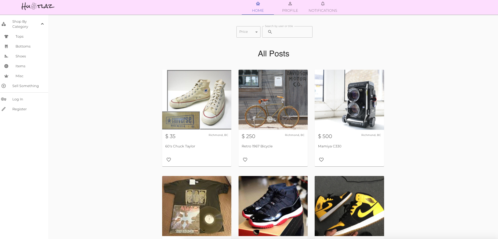
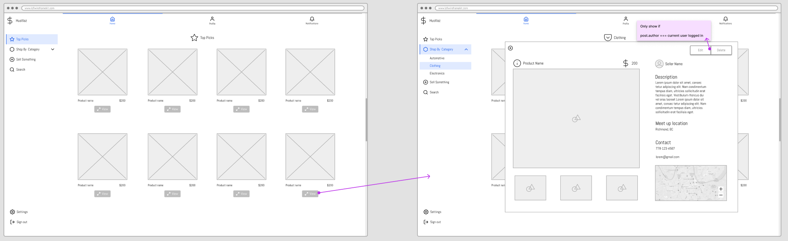
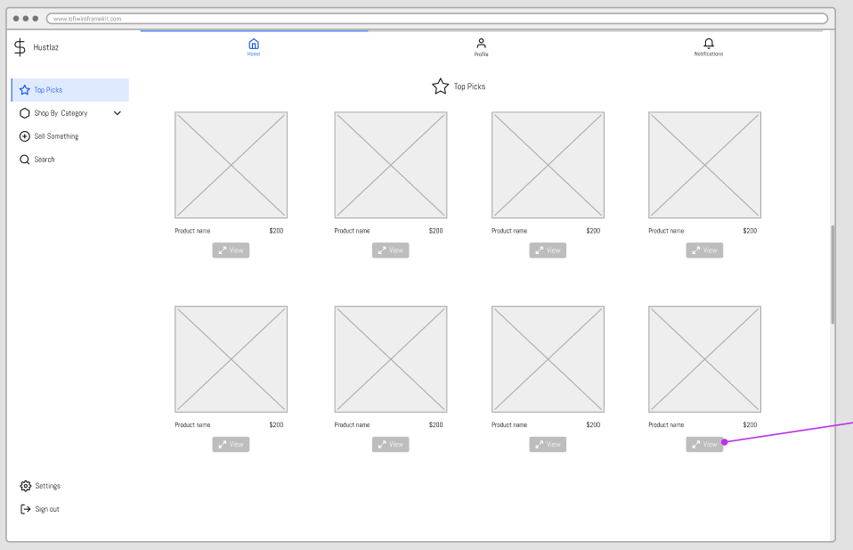
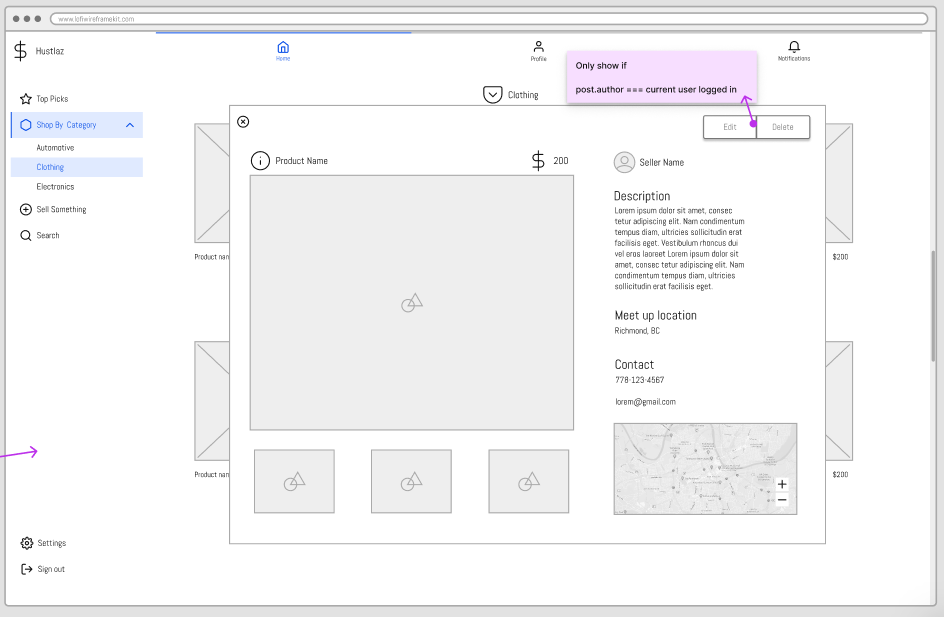
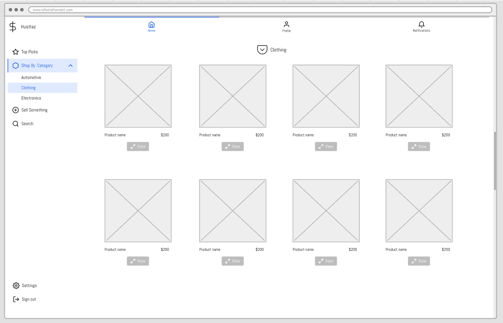
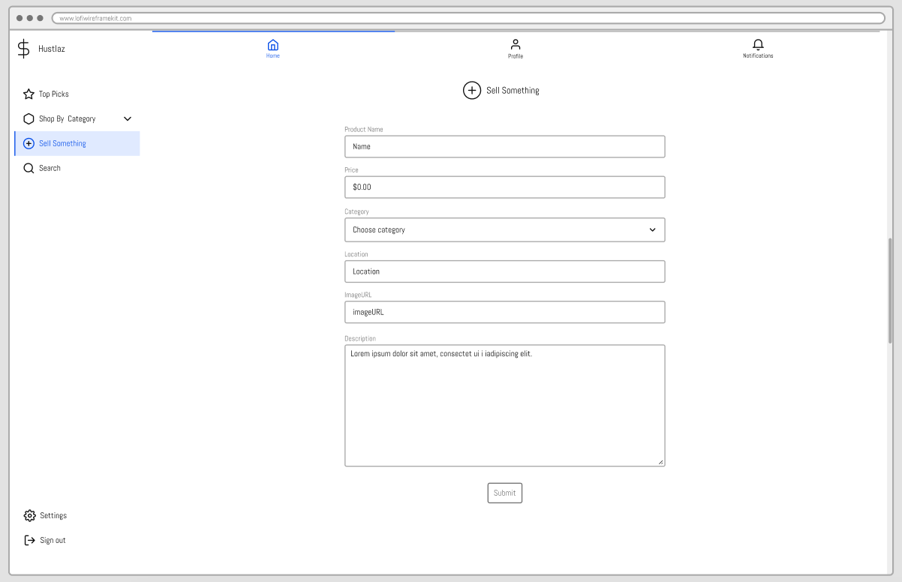
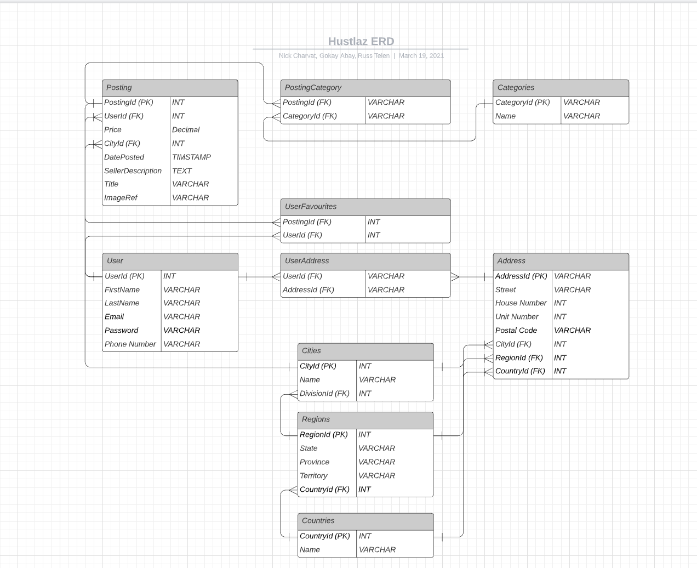

# Hustlaz by Russ, Gokay  and Nick 2021 &copy;

## View the app live
<h2><a href="https://hustlaz.netlify.app/">Hustlaz</a></h2>

## Description
    Hustlaz is a buying and selling platform for vintage items. 

## Features
  - Save items to favorites
  - Filter products per catgeory or price
  - Search for products
  - Create, update and delete products as long as they're authenticated
  - Users are able to add and update personal information such as name, address and contact info

## Technologies Used

### Front End
- React
- Material UI
- Bootstrap

### Back End
- NodeJS
- MySQL
- RDS
- S3
- Cognito
- API Gateway
- Lambda

## Preview

## Protoypes

### Overview

### Home View (Top Picks / Items Nearby / etc)

### Detail View

### Shop By Category View

### Add A Posting View

## Requirements

### Functional Requirements

- Create/delete/edit/read postings
- Users can sign up and login
- Categorize postings

### Non-Functional Requirements

- Manage postings from a database
- Manage user pool and user authentication Cognito
- Add category table in db and join with posting

### Nice To Have

- Implement chat system with firebase real time db
- Rate users
- Cluster map of sellers/geolocation
- Save postings
- Upload picture files
- Payment method

### Misc

- Figma (mockup)
- LucidChart (ERD)

### Database structure

## MySQL

